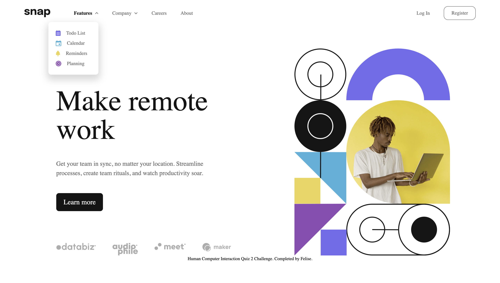
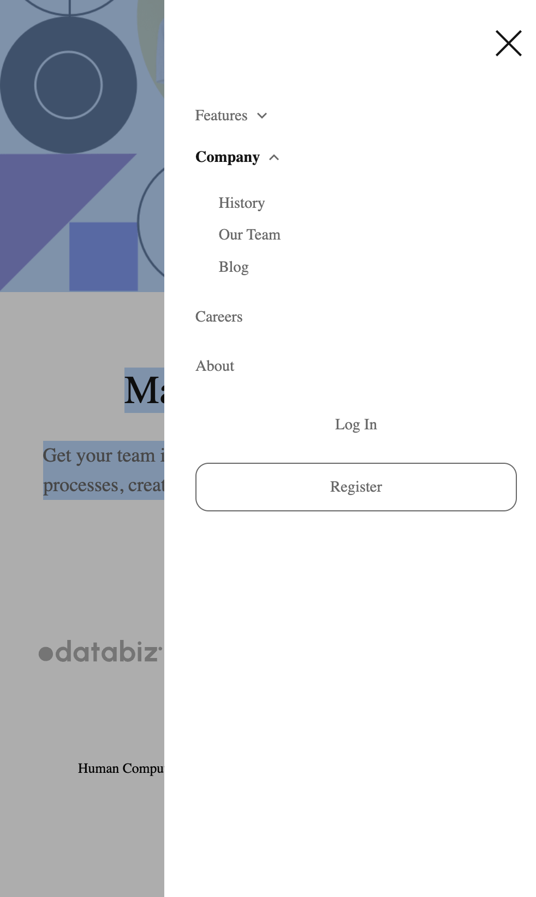

# Quiz 2 - Intro section page with interactive dropdown menu solution

This is a solution to the [Intro section page with interactive dropdown menu Quiz 2 challenge]

## Table of contents

- [Overview](#overview)
  - [The challenge](#the-challenge)
  - [Screenshot](#screenshot)
  - [Links](#links)
- [My process](#my-process)
  - [Built with](#built-with)
  - [What I learned](#what-i-learned)
  - [Continued development](#continued-development)
  - [Useful resources](#useful-resources)
- [Author](#author)
- [Acknowledgments](#acknowledgments)

## Overview

### The challenge

Users should be able to:

- View the relevant dropdown menus on desktop and mobile when interacting with the navigation links
- View the optimal layout for the content depending on their device's screen size
- See hover states for all interactive elements on the page

### Screenshot





### Links

- Solution URL: (https://github.com/FelAmore/Quiz-2---Felise)
- Live Site URL: (https://felamore.github.io/Quiz-2---Felise/)

## My process

### Built with

- Semantic HTML5 markup
- CSS custom properties
- Flexbox
- CSS Grid
- [Styled Components](https://styled-components.com/) - For styles

### What I learned

```html
<h1>class="d-flex gap-400 align-items-center"</h1>
```
```css
.nav-cta-btn a {
    display: block;
    text-align: center;
    width: 100%;
}
```
```js
const dd_trigger = document.querySelectorAll('.dd-trigger');
```

### Useful resources

- [Footer resource](https://stackoverflow.com/questions/15629511/how-can-i-make-my-footer-center-to-the-bottom-of-the-page) - This helped me set the footer at the bottom centre.

## Author 

- FullName - Felise Amore Pandiora
- StudentID - 2602174453
- BINUS Email - felise.pandiora@binus.ac.id

## Acknowledgments

I managed to complete this challenge thanks to my friends help and also external helps like youtube videos and websites.
